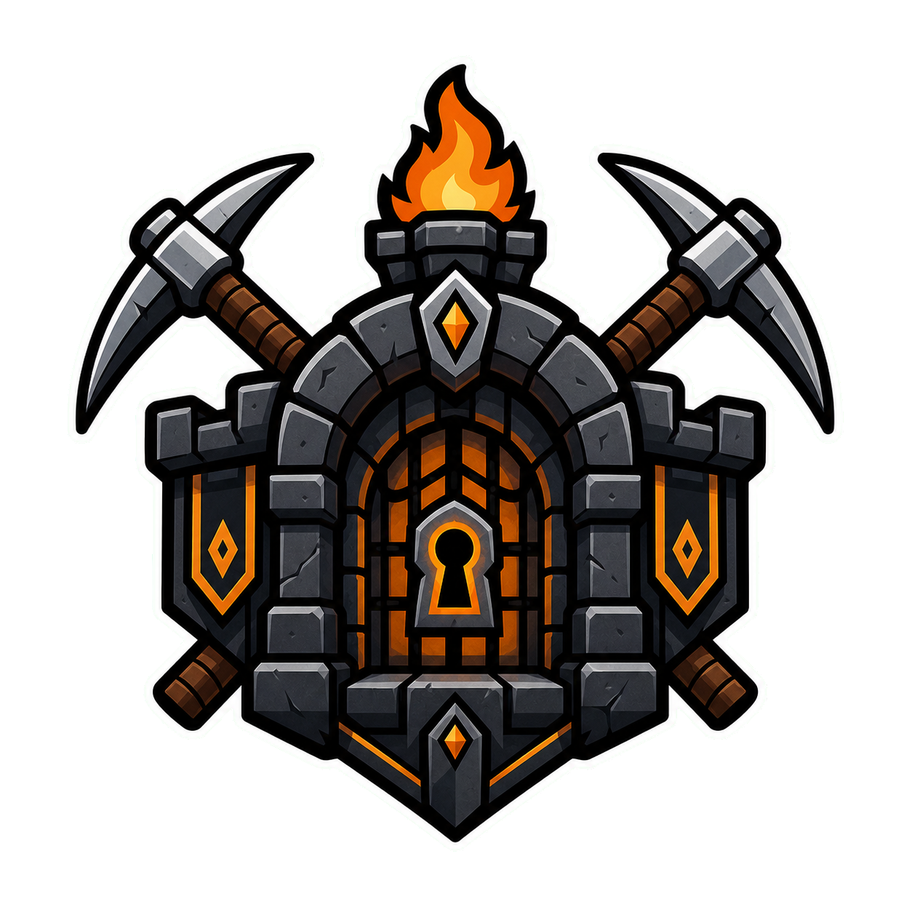

<section class="hero">
  <div>
    <h1><span class="accent">InstancedDungeons</span><span class="break">Pro</span></h1>
    <p>
      A clean dungeon system for Minecraft servers: <strong>private instances</strong>,
      party runs, staged progression, rewards, mob encounters, and event automation
      in one polished workflow.
    </p>
    <div class="hero-badges">
      <span class="hero-badge">Paper 1.21.x / 26.1.x</span>
      <span class="hero-badge">Java 21+ / 25+</span>
      <span class="hero-badge">Multiverse-Core</span>
      <span class="hero-badge">Production Scale</span>
      <span class="hero-badge">Advanced Mob Gear</span>
    </div>
    <div class="hero-actions">
      <a class="md-button md-button--primary" href="getting-started/">Get Started</a>
      <a class="md-button" href="commands/">Command Reference</a>
    </div>
  </div>
  
</section>

## Pro Overview

This section documents the production build for larger dungeon networks, tower routes, advanced rewards, mob encounters, and event automation.

<div class="status-row">
  <div class="status-box"><strong>Instances</strong><span>Configurable global active instance handling</span></div>
  <div class="status-box"><strong>Stages</strong><span>Large stage chains and mission layouts</span></div>
  <div class="status-box"><strong>Towers</strong><span><code>FIRST -> MIDDLE -> ... -> LAST</code></span></div>
  <div class="status-box"><strong>Items</strong><span>Enchanted vanilla gear in costs and rewards</span></div>
</div>

## Main Systems

<div class="grid">
  <div class="doc-card">
    <h3>Large Dungeons</h3>
    <p>Build multi-stage dungeon routes with detailed mission layouts and larger mission block sets.</p>
  </div>
  <div class="doc-card">
    <h3>Stage Keys</h3>
    <p>Configure stage key requirements and distribute keys across multiple loot chests.</p>
  </div>
  <div class="doc-card">
    <h3>Loot and Rewards</h3>
    <p>Keep enchantments on vanilla armor, tools, weapons, books, potions, arrows, costs, and rewards.</p>
  </div>
  <div class="doc-card">
    <h3>Mob Equipment</h3>
    <p>Give supported vanilla mobs helmets, armor, main-hand items, off-hand items, and drop chances.</p>
  </div>
  <div class="doc-card">
    <h3>Tower Chains</h3>
    <p>Connect multiple dungeon templates into one continuous multi-stage adventure from start to finish.</p>
  </div>
  <div class="doc-card">
    <h3>Validation</h3>
    <p>Validation checks Pro tower chains, mob equipment compatibility, enchantments, and item formats.</p>
  </div>
</div>

## Fast Path

1. Install the plugin and Multiverse-Core.
2. Create a template world.
3. Create a dungeon with `/dungeon create`.
4. Set spawn, exit, and objective data in editor mode.
5. Run `/dungeon validate <id>`.
6. Let players open, join, and start a party.

```text
/dungeon create dragon_lair dragon_template boss
/dungeon edit dragon_lair
/dungeon setspawn
/dungeon setexit
/dungeon setboss
/dungeon save
/dungeon reload
```
